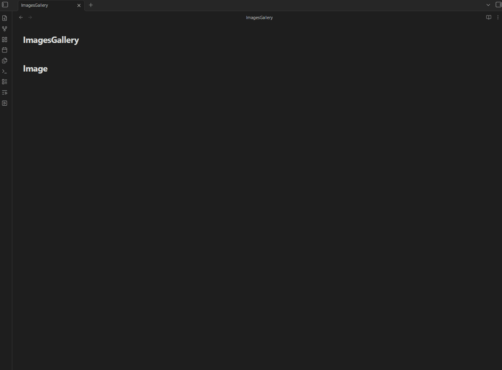

# Media Gallery

**Media Gallery lets you create a gallery of your video and image files directly inside of your notes in Obsidian**

## Roadmap
- [x] Video support
- [x] Image support
- [ ] Audio support
- [ ] Pdf support

## Examples

### 

**Video**


**Image**
 


## Installation

### Via BRAT (Beta)
1. Install the [BRAT plugin](https://github.com/TfTHacker/obsidian42-brat) in Obsidian.
2. Open BRAT settings and click "Add Beta Plugin".
3. Enter this repository URL: `https://github.com/RobertoJarquinRR/Media-Gallery-view`
4. Enable the plugin in Obsidian's Community Plugins settings.

### Via Obsidian Community Plugins
Search for "Media Gallery" in Obsidian's Community Plugins browser and install it directly.

## Usage

Create a code block with the language set to `MediaGallery` in any note. Specify a `path:` to the folder containing your media, and an optional `type:` to choose between a video or image gallery. If `type:` is omitted, the gallery defaults to video.

````md
```MediaGallery
path: directory/videos
type: video
```
````

````md
```MediaGallery
path: directory/images
type: image
```
````

The plugin will render all matching files found in the specified folder as a gallery grid.

- **Video gallery**: hover a card to reveal playback controls.
- **Image gallery**: click a card to open it in a fullscreen lightbox. Close it by clicking the background or pressing `Esc`.
- **Both**: double-click a card to open the underlying file in a new tab.

## Recommendation

For a better video playback experience, consider installing the **Media Extended** plugin. Note that this only improves playback when you open a video in a separate note — the gallery itself renders videos with the default HTML5 player for performance reasons.